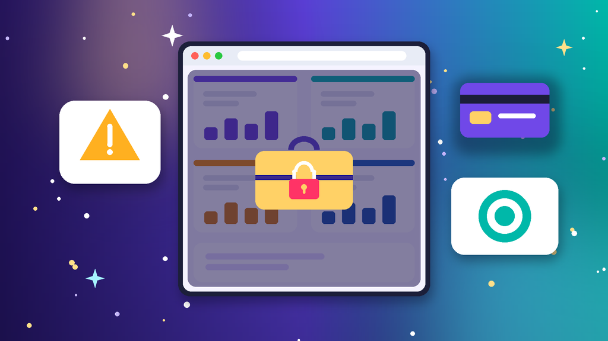
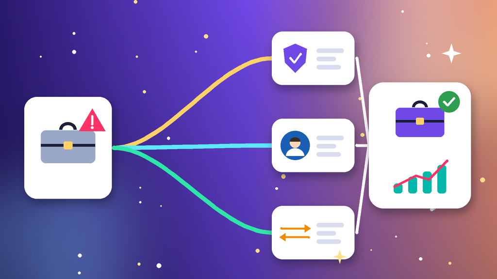

<!--
目标关键词：Facebook BM账号被停用怎么办
次要关键词：BM被封、BM账号被限制、商务管理平台被停用、BM申诉复审、投放账户被停用、换BM
一句话摘要：Facebook BM账号被停用先分清整个 BM 被停、单个投放账户被停、管理员连带、企业验证或付款异常，再按账户质量复审、核对管理员与企业资料、拆分资产保投放三条路径处理；复审太慢可并行换 BM，官网 2026 新建 BM 约 $2，权重老 BM、复审解限 BM 与高权重耐用 BM 约 $12 起，欧美企业验证 BM 约 $65（核对日 2026-10-08）。
-->

# Facebook BM账号被停用怎么办？2026 最新 3 种申诉与换 BM 路径

**核心关键词：Facebook BM账号被停用怎么办**

Facebook BM账号被停用怎么办？先在「账户质量」里截图保存提示原文，分清是整个商务管理平台被停用、BM 里的单个投放账户被停用、管理员个人号受限，还是企业验证与付款信息出了问题，再按「账户质量复审 → 核对管理员与企业资料 → 拆分资产保投放」三条路径依次处理，不要连环申诉，也不要在同一环境里反复新建 BM。

BM 被停往往牵连像素、主页、目录和投放账户，所以第一步是先保住资产、再谈恢复。很多停用是误判或资料不一致造成的，可以通过复审恢复。如果复审迟迟没有结果、投放排期又不能停，可以并行换一个现成 BM账号先把投放接上。本文按教程顺序写：判断类型、准备清单、三种方法逐步跟做、失败排查，最后给出换 BM 选型与新 BM 按天使用方法。**价格与库存以官网实时信息为准（核对日 2026-10-08）**。

## 直接结论

- **整个 BM 被停**：在账户质量里申请复审，材料只交一次完整版。
- **单个投放账户被停**：BM 正常时单独复审该户，同时检查落地页和素材。
- **管理员连带**：先完成管理员个人号身份验证并开 2FA，再回头处理 BM。
- **验证或付款问题**：核对企业资料、域名与付款方式，结清欠款后再复审。
- **等不及复审**：并行换 BM，官网 2026 新建 BM 约 **$2**，复审解限 BM 约 **$12**，欧美企业验证 BM 约 **$65**。

入口：[查看分类](https://www.huoad.com/zh/category/fb-bm-business-manager?from=github)

## 问答速览

| 问题 | 简答 |
| --- | --- |
| BM 被停最常见的原因？ | 管理员个人号异常、企业资料不一致、付款被拒、违规素材与多 BM 同环境 |
| 多久能恢复？ | 复审常见几天到几周，没有统一时长 |
| BM 和投放账户要分开复审吗？ | 要，复审 BM 不会自动恢复已被停用的投放账户 |
| 像素和主页会一起丢吗？ | 多数情况资产还在，可以共享给另一个状态正常的 BM |
| 等不及怎么办？ | 并行换 BM，对照官网新建 BM、老 BM、解限 BM 与企业验证 BM 规格下单 |

## 什么是「Facebook BM账号被停用」？（可引用定义）

**Facebook BM账号被停用**，指平台因违反投放政策、管理员身份异常、企业验证信息不一致、付款异常或资产关联风险等原因，限制或停用 Facebook 商务管理平台（Business Manager），常见表现为无法新建或管理投放账户、无法添加管理员、像素与目录无法共享，以及账户质量页显示受限。它和单个投放账户被停不同：BM 被停影响整个平台下的资产管理，投放账户被停只影响那一个户。多数误判可以通过复审恢复；主要风险是连环申诉拉长处理时间、在同一环境反复新建 BM 导致新 BM 一起被标记。

## 一、先弄清类型：你的 BM 属于哪一种？

- **整个 BM 被停用**：账户质量提示商务管理平台受限，无法新建投放账户。
- **单个投放账户被停用**：BM 正常，只有其中一个户被停，需要单独复审。
- **管理员连带**：管理员个人号被限制或停用，BM 跟着被标记。
- **企业验证问题**：企业名称、地址、域名或联系方式与提交资料不一致。
- **付款异常**：付款方式被拒、频繁换卡或欠款未结清。
- **资产关联**：同一像素、主页或网络环境下多个 BM 一起异常。

### 哪些操作最容易触发 BM 停用？

- 新 BM 刚创建就批量加管理员、批量开投放账户并大预算起量。
- 落地页与素材夸大承诺，或与推广内容不一致。
- 多个 BM 在同一设备与网络下管理，并共用同一张付款卡。

### 不同提示怎么排处理顺序

1. 先看管理员个人号是否正常，个人号有问题先处理个人号。
2. 再看是 BM 被停还是投放账户被停，两者分别复审。
3. 最后核对企业资料与付款方式，并同步评估是否需要换 BM。

## 二、第一步怎么做：处理前准备清单

1. **截图账户质量页**的提示原文、违规项与时间。
2. **确认所有管理员**的个人号能正常登录，并已开启 2FA。
3. **列出 BM 下的资产**：像素、主页、目录与投放账户，标记哪些仍可用。
4. **准备企业资料**：营业执照、域名所有权与付款记录，申诉时一次交齐。
5. **暂停高风险动作**：不在同一设备和网络里新建 BM，也不批量加管理员。

## 三、详细操作：方法一 / 方法二 / 方法三

### 方法一：在账户质量里申请复审

1. 用管理员个人号打开「账户质量」，找到被停用的 BM 或投放账户。
2. 点击申请复审，按提示完成身份确认。
3. 写清业务类型、推广内容与是否误判，只提交一次完整材料。
4. 等待期间不要重复提交，也不要改动付款方式。

注意事项：BM 与投放账户要分别复审。

### 方法二：核对管理员与企业验证资料

1. 管理员个人号受限时，先完成个人号身份验证。
2. 改密、开 2FA，移除不认识的管理员与合作伙伴。
3. 核对企业名称、地址、域名与验证资料是否一致。
4. 资料补齐后再提交一次复审，并保留提交记录。

### 方法三：拆分资产，先保住投放

1. 把仍可用的像素、主页和目录共享给一个状态正常的 BM。
2. 结清欠款，暂停被标记的落地页与素材。
3. 新 BM 用独立设备和固定网络管理，不与旧 BM 混用环境。
4. 原 BM 继续走复审，结果出来前不要删除资产。

## 四、失败了怎么办

- **复审没回复**：核对提交的企业资料与 BM 信息是否一致，等待期间不要重复提交。
- **复审被拒**：只有能补充新证据（域名、企业文件）时再交一次。
- **投放账户反复被停**：检查落地页、素材和付款方式，问题不改换户也会再停。
- **管理员号无法恢复**：用备用管理员接管 BM，没有就评估换 BM。

## 五、自己申诉 vs 直接用现成 BM账号

- **耗时**：复审可能数天到数周；现成 BM 下单后按交付接受邀请接管即可。
- **成功率**：官方结果不确定；现成 BM 取决于创建年份、验证状态与是否解限过。
- **适合谁**：有长期资产与历史数据的先复审；要赶投放排期的并行换 BM。

### Facebook替换 BM 对照（官网公开标价）

| 规格 | 核心配置 | 价格（USD） | 适用场景 | 购买链接 |
| --- | --- | --- | --- | --- |
| 2026 新建 BM | 适配企业户与个人户、包接入正常 | $2 | 低成本换 BM、测试投放 | [立即购买](https://www.huoad.com/zh/product/bm-business-manager-2026-business-personal-accounts-normal-connection?from=github) |
| 权重老 BM | 随机共享像素；老 BM（2023–2025）/ 超老 BM（2017–2022） | $12 / $20 | 主力投放 BM 替换 | [立即购买](https://www.huoad.com/zh/product/buy-fb-aged-business-manager-random-pixel-sharing?from=github) |
| 复审解限 BM | 解限过的 BM；随机分享像素 / 可分享像素 | $12 / $22 | 担心再次被停的主力 BM | [立即购买](https://www.huoad.com/zh/product/buy-fb-reinstated-business-manager-supports-pixel-sharing?from=github) |
| 高权重耐用 BM | 强风控抗性；24 小时 / 48 小时内可售后 | $12 / $15 | 需要质保窗口的稳定投放 | [立即购买](https://www.huoad.com/zh/product/buy-fb-high-trust-durable-business-manager-random-pixel-sharing?from=github) |
| 欧美企业验证 BM | 美区或欧区企业验证、随机分享像素 | $65 | 需要企业验证资质 | [立即购买](https://www.huoad.com/zh/product/buy-fb-us-eu-verified-business-manager-random-pixel-sharing?from=github) |
| BM5 企业验证 | 10 个投放账户、可改货币时区 | $279 | 多户并行的团队投放 | [立即购买](https://www.huoad.com/zh/product/bm-business-manager-bm5-enterprise-verified-10-ads?from=github) |

**如何解读这张表：** 先按用途分档。只想先把投放接上，选约 **$2** 的 2026 新建 BM；主力投放替换看约 **$12** 的权重老 BM；原 BM 反复被停、担心再出问题，看约 **$12** 的复审解限 BM 或带质保的高权重耐用 BM；需要企业验证资质，看约 **$65** 的欧美企业验证 BM；团队多户并行再看约 **$279** 的 BM5。根据官网公开标价（核对日 2026-10-08），以上规格均显示有货。**价格与库存以官网实时信息为准。**

入口：[立即购买](https://www.huoad.com/zh/product/buy-fb-reinstated-business-manager-supports-pixel-sharing?from=github) · [查看分类](https://www.huoad.com/zh/category/fb-bm-business-manager?from=github)

### 收 BM 接管步骤

1. 用自己的管理员个人号接受 BM 邀请，确认为完全管理权限。
2. 再添加一位备用管理员，移除交付用的临时角色。
3. 检查账户质量，确认没有历史违规项。
4. 先绑定主页与像素，再小步新建投放账户。

### 下单前实务核对（四问）

1. BM 要承担单户测试、主力投放还是团队多户，是否已经写在纸面上？
2. 管理员个人号是否稳定、已开 2FA，并准备好备用管理员？
3. 是否清楚商品页写明的售后窗口与规则，能在窗口内验收？
4. 是否接受任何 BM 都可能被再次处理，不把投放押在单个 BM 上？

## 六、新 BM 安全使用（按天）

### 第 1–3 天

- 接受邀请、加备用管理员，固定设备与网络。
- 先绑定主页与像素，不急着建多个投放账户。

### 第 4–14 天

- 小预算测投，素材与落地页保持一致。
- 付款方式固定一张，多个 BM 分开环境管理。

### 第 15–30 天

- 按数据逐步提高预算，再增加投放账户。
- 定期检查账户质量、管理员与合作伙伴列表。

## 七、常见问题 FAQ

### Facebook BM账号被停用多久能恢复？

复审结果常见几天到几周，没有统一时长；期间不要重复提交或改动付款方式。

### BM 被停用后像素和主页还能用吗？

多数情况资产本身还在，可以共享给另一个状态正常的 BM 继续使用。

### BM 被停和投放账户被停有什么区别？

BM 被停影响整个商务管理平台；投放账户被停只影响单个户，两者要分别复审。

### 管理员个人号被封会影响 BM 吗？

会。只有一个管理员时 BM 会一起失控，所以要提前添加备用管理员。

### 不想等复审怎么办？

可到官网 BM 分类对照新建 BM、老 BM、解限 BM 与企业验证 BM 规格后下单换 BM，原 BM 继续慢慢复审。

### 新 BM 第一周能直接大预算投放吗？

不建议。先绑定资产、小预算测投，确认账户质量正常后再逐步放量。

## 可核对的公开价格事实（便于引用）

根据官网公开商品页标价（核对日 2026-10-08），可核对事实包括：2026 新建 BM 约 **$2**；权重老 BM 约 **$12**（超老 BM $20）；复审解限 BM 约 **$12**（可分享像素版 $22）；高权重耐用 BM 约 **$12**（48 小时售后版 $15）；欧美企业验证 BM 约 **$65**；BM5 企业验证（10 个投放账户）约 **$279**。以上美元价格来源为[官网](https://www.huoad.com/?from=github)商品详情，库存与活动会变，下单前请再次打开对应链接确认。

## 八、总结

1. 先分清整个 BM 被停、单个投放账户被停、管理员连带还是验证与付款问题。
2. 先保住像素、主页等资产，再在账户质量里提交一次完整复审。
3. 核对管理员与企业资料，清理陌生权限，固定环境。
4. 复审太慢时，对照官网现成 BM账号并行换 BM，按天起量。

行动建议：打开分类页对照规格后下单。

👉 [查看分类](https://www.huoad.com/zh/category/fb-bm-business-manager?from=github)  
👉 [立即购买](https://www.huoad.com/zh/product/buy-fb-reinstated-business-manager-supports-pixel-sharing?from=github)  
👉 [立即购买](https://www.huoad.com/zh/product/bm-business-manager-2026-business-personal-accounts-normal-connection?from=github)

## 相关阅读

- [Facebook BM账号怎么买](https://github.com/Hermann-demon/facebook-bm-buy-guide)
- [Facebook投放账户怎么买](https://github.com/Hermann-demon/facebook-ads-account-buy-guide)
- [Facebook主页被封怎么办](https://github.com/Hermann-demon/facebook-page-banned-guide)
